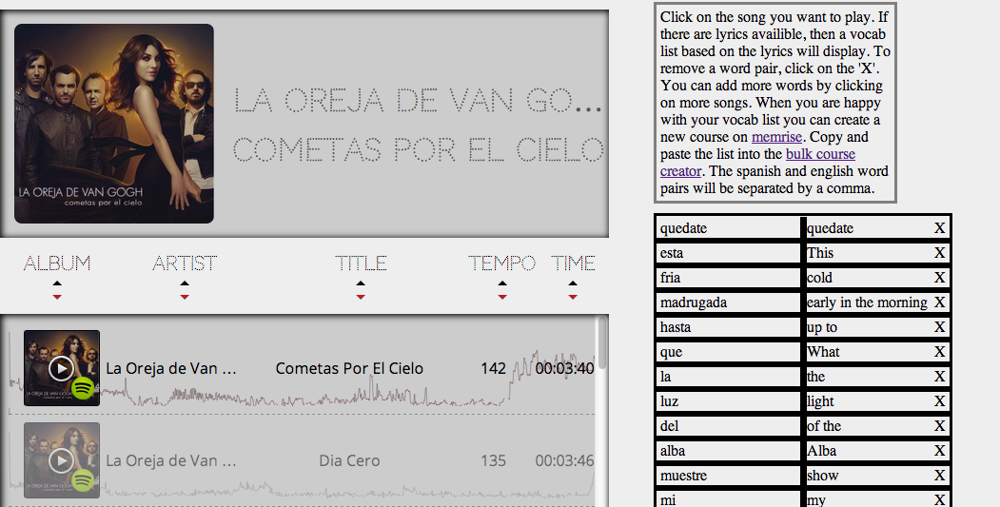

# Letra Learner

Plays a song in the spotify player and if the lyrics are availble, translates each word from the initial language (spanish) to english and creates a vocab set based off of the lyrics. I love to listen to music in the language I'm learning and this will make it easier to pick up new vocab words from my favorite songs. The idea was to directly inegrate with [memrise](memrise.com), an awesome flashcard app, but they no longer have API support. Foruntely, they do have a bulk course creater so you can copy and paste the vocab set & create your deck all in one go.

## APIs Used
* [Spotify's Web API](https://developer.spotify.com/technologies/web-api/)
* [Echo Nest's API](http://developer.echonest.com/docs/v4)
* [Bing Trnaslate API](http://bing.com)
* [MusicXmatch](https://developer.musixmatch.com/)

## To get running
Add a file called translate/key.js with the following private keys needed to run this project:
* ms_translate_key - Mircosoft Bing's translator
* music_match_key - musicXmatch's key

## TODO
1. Add a seach box. The query used to get the songs is curretly hard coded.
1. Support more more languages. musicXmatch already returns the song's language.
1. The musicXmatch ID is retriaved thru echonest. Its possible to retireve the ID directly from music match.
1. Don't display songs with missing lyrics. There is no point.
1. Más styling por favor.
1. Code is all over the place. I wrote the pieces individual and then combine them without much thought.

## Code initially from & inspired by
[DGME's project 3](https://github.com/DGMD-E-15/Project-3/)
